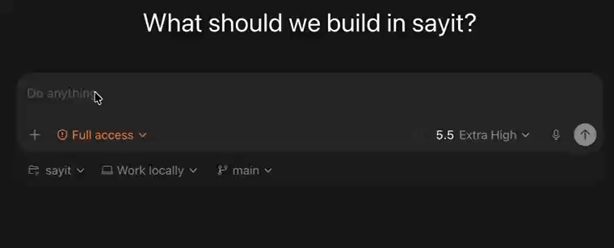
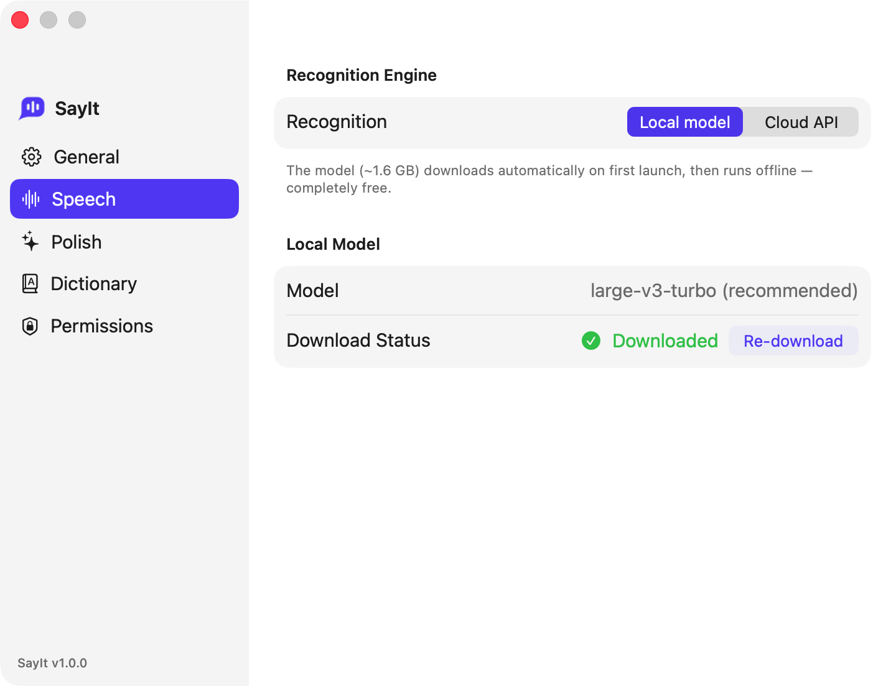
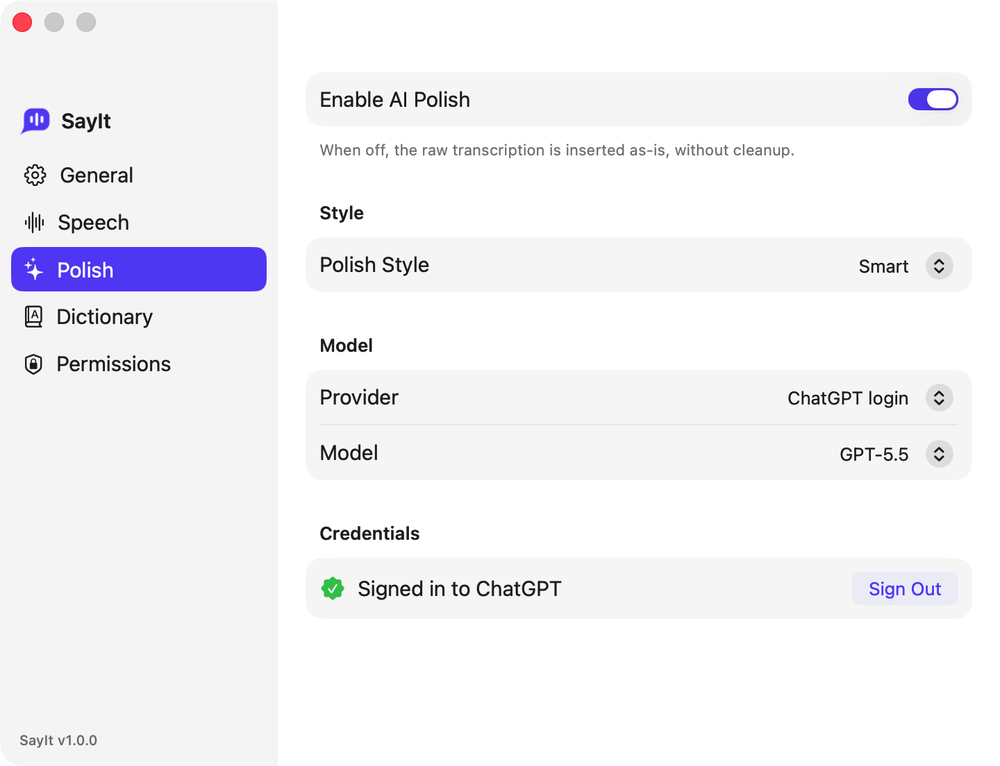

  

  <h1>SayIt</h1>

  

    <strong>免费、原生的 macOS AI 润色语音输入。</strong> 
    按一个键、说话，干净的文字直接落到光标处——在任何 app 里。
  

  

    
    
    
    
  

  

    <strong><a href="https://github.com/Wentong-Liu/SayIt/releases/latest/download/SayIt.dmg">⬇️&nbsp;下载最新版 SayIt.dmg</a></strong> · <a href="https://github.com/Wentong-Liu/SayIt/releases">所有版本</a>
  

  

    <a href="README.md">English</a> · <strong>简体中文</strong>
  

  

**喜欢 Typeless，但觉得免费额度不够用？** SayIt 用**本地模型**做语音识别、用**你已经在付的 Codex 订阅**来润色——**完全免费**，没有额度、没有月费。

按住键说话，松开，润色好的文字就出现在你光标的位置。给整天对着 AI 说话的人用——vibe coder、写东西的人、任何「宁可说也不想打字」的人。

## 为什么选 SayIt

### ⚡ 本地识别，快到几乎即时

语音在**你的 Mac 本地转写，走苹果神经引擎（NPU）**——就是驱动端侧 AI 的那块芯片。快，而且不管你说多久都快：在 **Apple M4 Pro** 上用推荐的 **large-v3-turbo** 模型实测，转写约 **0.4 秒**——9 秒的音频不到半秒出字，约 **20× 实时**，短句也一样快。速度因机器而异，但识别全程**在本地、离线、音频不出本机**。

### ♻️ 用你已有的 Codex 订阅来润色

你要是在 vibe coding，多半已经在付 **ChatGPT / Codex** 或 **Claude**。SayIt 直接用那个账号或 API 润色你的口述稿——去语气词、补标点、顺措辞——所以**不用再订第二个、不用额外花钱**。

### 🆓 所以是真·免费

本地识别免费且离线；润色蹭你已有的 AI 订阅。你**永远不用给 SayIt 付钱**。而且润色是可选的——关掉它，SayIt 照样 100% 免费、纯离线。

## 怎么用

1. **按住或轻点**触发键（默认右 ⌥ Option）。
2. **说话。**
3. **松开或再点一下**——润色好的文字出现在光标处。

就这样。触发键、交互方式、用哪个 AI 润色、界面语言、麦克风，都在**设置**里。

## 设置

|  |  |
|:--:|:--:|
|  |  |
| **语音** —— 本地模型或云端 API，以及用哪个模型 | **润色** —— 登录 ChatGPT/Codex 或填你自己的 API Key，外加风格和模型 |

## 环境要求

- macOS 14 及以上，推荐 Apple Silicon。
- 本地模型约需 1–2 GB 磁盘，首次启动时自动下载一次。

## 安装

从 [最新 Release](https://github.com/Wentong-Liu/SayIt/releases/latest) 下载 **[`SayIt.dmg`](https://github.com/Wentong-Liu/SayIt/releases/latest/download/SayIt.dmg)**，打开后把 **SayIt** 拖进 **应用程序**。它经过 Developer ID 签名并公证，双击直接打开、不会有 Gatekeeper 警告。

首次启动时，SayIt 会**自动下载本地语音模型**（约 1–2 GB，仅一次）——可在 设置 和 菜单栏 看到进度。下载完成后还有**一次性的准备过程**——模型要为苹果神经引擎编译，首次大约需要一两分钟；准备好后即可听写，之后一直很快。另外请在 系统设置 → 隐私与安全性 里授予**麦克风**和**辅助功能**——辅助功能用于监听全局热键、并把文字注入到其它 app。

要启用 AI 润色，需**手动在 设置 → 润色 里登录你的 ChatGPT 账号**——这是默认方式，用你已有的 ChatGPT/Codex 订阅（也可改用你自己的 OpenAI、Anthropic 或 DeepSeek API Key）。登录之前 SayIt 照常可用，只是直接插入未润色的原始转写文本。

## 隐私

- **本地识别 100% 在本机、离线**——用本地引擎时，音频绝不离开你的 Mac。
- **云端识别和 AI 润色只在你主动开启时才用**，用的是你自己的账号或 key。
- **剪贴板会还原**——SayIt 注入文字后，会把你原本复制的内容放回去。

## 贡献

欢迎提 issue 和 PR。几条约定：Xcode 工程由 XcodeGen 从 `project.yml` 生成（新文件放 `App/` 或 `SayItCore/Sources/` 下，再跑 `xcodegen generate`）；文档、代码注释、提交信息一律用英文。

## 许可

[MIT](LICENSE)

用 [Claude Code](https://claude.com/claude-code) 构建。
